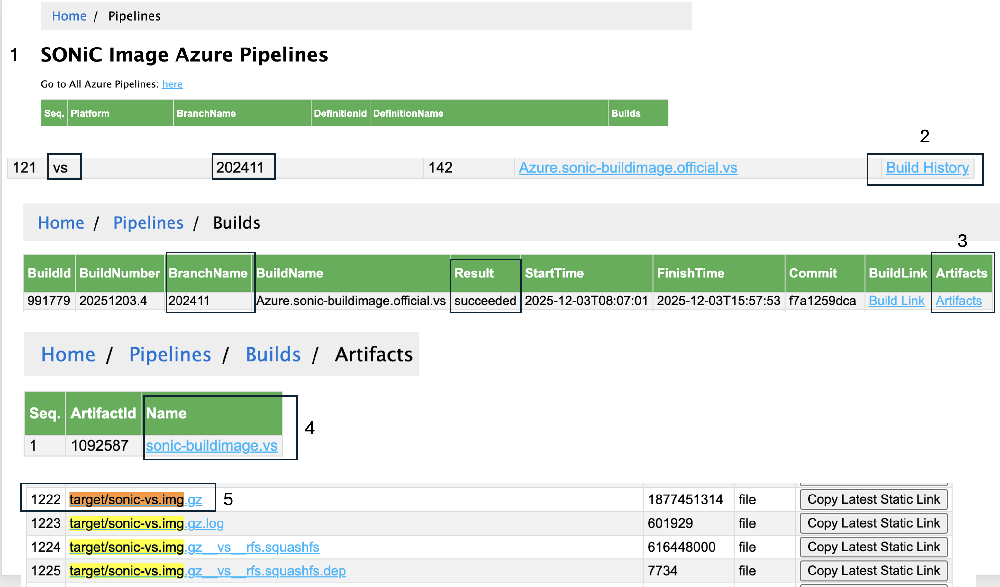

# SONiC & SR Linux EVPN L2LS Lab

> [!NOTE]
> This repository contains a Containerlab topology to demonstrate EVPN L2LS interoperability between **SONiC** and **Nokia SR Linux**.

## 📋 Overview

The purpose of this repository is showing how to create a SONiC image to be used in a container lab setup and the configuration required at both the SONiC JSON and FRR/BGP levels to deploy a simple EVPN layer 2 service.

This lab simulates a small Data Center fabric with:
- **Spine:** Nokia SR Linux
- **Leaf 1:** SONiC (Virtual Switch)
- **Leaf 2:** Nokia SR Linux
- **Clients:** Linux Alpine hosts

The goal is to establish L2 EVPN connectivity between Client 1 (connected to SONiC) and Client 2 (connected to SR Linux).

### Topology


## 🛠️ Prerequisites & Image Setup

Before starting, ensure you have [Containerlab](https://containerlab.dev/install/) and [Docker](https://docs.docker.com/engine/install/) installed.

### Obtaining the SONiC Image

To run SONiC in Containerlab, you need a compatible image. There are two main approaches, but this lab uses **Option 2 (vrnetlab)** to simulate a realistic architecture.

#### Step 1: Download from Azure Pipeline

1.  Go to the [SONiC Azure Pipelines](https://sonic-build.azurewebsites.net/ui/sonic/pipelines).
2.  Scroll down to where the **"vs"** platform is listed.
3.  Choose a build (e.g., `202411`) and click on **Build History**.
4.  Pick one where "Result = succeeded" and click on **Artifacts**.
5.  Click on `sonic-buildimage.vs`.
6.  Download the `target/sonic-vs.img.gz`.



> [!TIP]
> These instructions are based on the [Containerlab Manual: Getting SONiC Images](https://containerlab.dev/manual/kinds/sonic-vs/#getting-sonic-images).

#### Step 2: Build the Image

```bash
# Check your downloaded file
ls | grep sonic
# sonic-vs.img.gz

# Unzip it
gunzip sonic-vs.img.gz
# Result: sonic-vs.img
```

Now you have two options to use this image:

<details>
<summary><strong>Option 1: Direct Docker Load (Not used in this lab)</strong></summary>

You can simply load the image into Docker.
```bash
docker load < docker-sonic-vs
```
**Drawback:** The end result is not very similar to a real SONiC router since processes like `shmp`, `swss`, `bgp` will not be running in separate containers.
</details>

**Option 2: Use vrnetlab (Recommended)**

Use the [vrnetlab tool](https://containerlab.dev/manual/vrnetlab/) to create a SONiC image that truly mimics the SONiC architecture (different processes in different containers).

1.  Move the image to your vrnetlab directory:
    ```bash
    mv sonic-vs.img ~/vrnetlab/sonic/sonic-vs-202411.qcow2
    ```
2.  Build the image:
    ```bash
    cd ~/vrnetlab/sonic
    make
    ```
3.  Verify the image:
    ```bash
    docker images | grep vrnetlab
    # vrnetlab/sonic_sonic-vs    202411    0abf9ef806c8   About a minute ago   6.42GB
    ```

**Why vrnetlab?**
It mimics the real architecture. You can see different containers for different processes inside the VM:

```bash
admin@sonic:~$ docker ps
CONTAINER ID   IMAGE                             COMMAND                  NAMES
6c0b1e92be5c   docker-router-advertiser:latest   "/usr/bin/docker-ini…"   radv
476887704c68   docker-gbsyncd-vs:latest          "/usr/local/bin/supe…"   gbsyncd
b0671ba89f97   docker-eventd:latest              "/usr/local/bin/supe…"   eventd
8249518149b4   docker-fpm-frr:latest             "/usr/bin/docker_ini…"   bgp
61e5be1a45a9   docker-syncd-vs:latest            "/usr/local/bin/supe…"   syncd
f2287fc3db9c   docker-teamd:latest               "/usr/local/bin/supe…"   teamd
a459756a8bf2   docker-orchagent:latest           "/usr/bin/docker-ini…"   swss
43f5388f05d5   docker-database:latest            "/usr/local/bin/dock…"   database
```

## 🚀 Deployment & Quick Start

### 1. Deploy the Topology

The [`evpn_sonic_l2ls.clab.yml`](./evpn_sonic_l2ls.clab.yml) file declaratively describes the lab.

```bash
sudo containerlab deploy --reconfigure
```

> [!IMPORTANT]
> **Wait for SONiC to boot.** It takes time. Check health status:
> ```bash
> docker ps | grep leaf1
> # Look for "(healthy)" status
> ```

### 2. Configure SONiC (Post-Boot)

Unlike SR Linux, SONiC needs post-boot configuration.

**Step A: Apply System Configuration (JSON)**
This script copies and applies `config_db.json`.

```bash
./deploy_sonic_cfg.sh
```
*What this does:*
1. Copies `configs/leaf1-config.json` to the host.
2. Replaces `/etc/sonic/config_db.json`.
3. Reloads configuration (`sudo config reload -y`).

**Step B: Apply Routing Configuration (FRR)**
This script configures BGP/EVPN via `vtysh`.

```bash
./deploy_bgp_vtysh.sh
```

### 3. Summary of Deployment Steps
1.  Deploy containerlab.
2.  Run `deploy_sonic_cfg.sh` (Updates JSON).
3.  Run `deploy_bgp_vtysh.sh` (Updates FRR).
4.  Run `pings.sh` (Populates ARP and verifies).

## 🧠 Deep Dive: SONiC Configuration & Architecture

### Interface Mapping (Containerlab vs SONiC)

In `evpn_sonic_l2ls.clab.yml`, interfaces are named `eth1`, `eth2`...
In SONiC, they map to `Ethernet0`, `Ethernet4`...

| Containerlab | SONiC Interface | Connected To |
| :--- | :--- | :--- |
| `eth1` | `Ethernet0` | Spine1 |
| `eth2` | `Ethernet4` | Client1 |

**Verification on SONiC:**
```bash
admin@sonic:~$ show interfaces status 
  Interface            Lanes       Speed    MTU    FEC           Alias    Vlan    Oper    Admin    Type    Asym PFC
-----------  ---------------  ----------  -----  -----  --------------  ------  ------  -------  ------  ----------
  Ethernet0      25,26,27,28  4294967.3G   9100    N/A    fortyGigE0/0  routed      up       up     N/A         N/A
  Ethernet4      29,30,31,32  4294967.3G   9100    N/A    fortyGigE0/4   trunk      up       up     N/A         N/A
  Ethernet8      33,34,35,36         40G   9100    N/A    fortyGigE0/8  routed    down       up     N/A         N/A
```

### Configuration Structure: JSON vs FRR

SONiC configuration is split between two key files.

#### 1. JSON Configuration (`/etc/sonic/config_db.json`)
Handles system state, interfaces, and basic BGP globals.

**Key JSON Snippets:**

*Global BGP Settings:*
```json
    "BGP_DEVICE_GLOBAL": {
        "STATE": {
            "idf_isolation_state": "unisolated",
            "tsa_enabled": "false",
            "wcmp_enabled": "false"
        }
    },
    "BGP_GLOBALS": {
        "default": {
            "default_ipv4_unicast": "true",
            "local_asn": "101",
            "router_id": "10.0.1.1"
        }
    }
```

*Device Metadata:*
```json
    "DEVICE_METADATA": {
        "localhost": {
            "bgp_asn": "101",
            "hostname": "sonic",
            "hwsku": "Force10-S6000",
            "mac": "22:d1:c7:63:8f:4a",
            "platform": "x86_64-kvm_x86_64-r0",
            "type": "LeafRouter"
        }
    }
```

> [!NOTE]
> The [SONiC Configuration Wiki](https://github.com/sonic-net/SONiC/wiki/Configuration) provides insights, but there is no single complete schema definition.

#### 2. FRR Configuration (`vtysh`)
Handles complex routing logic (Route Maps, Neighbors, EVPN).

```bash
admin@sonic:~$ vtysh
Hello, this is FRRouting (version 10.0.1).
sonic#
```

Some BGP options (like import/export policies) **must** be configured here, as they are not fully supported in the JSON config.

### VXLAN Configuration Details

We map VLAN 100 to VNI 100.

**JSON Configuration:**
```json
    "VLAN": { "Vlan100": { "vlanid": "100" } },
    "VLAN_MEMBER": { "Vlan100|Ethernet4": { "tagging_mode": "untagged" } },
    "VXLAN_TUNNEL": { "VXLAN100": { "src_ip": "10.0.1.1" } },
    "VXLAN_TUNNEL_MAP": { "VXLAN100|map_100_Vlan100": { "vlan": "Vlan100", "vni": "100" } }
```

**Equivalent CLI Commands:**
```bash
sudo config vlan add 100
sudo config vlan member add 100 Ethernet4 --untagged
sudo config vxlan add VXLAN100 10.0.1.1
sudo config vxlan map add VXLAN100 100 100
```

**Verification:**
```bash
admin@sonic:~$ show vxlan interface
VTEP Information:
	VTEP Name : VXLAN100, SIP  : 10.0.1.1
	Source interface  : Loopback0

admin@sonic:~$ show vlan brief
+-----------+--------------+-----------+----------------+-------------+
|   VLAN ID | IP Address   | Ports     | Port Tagging   | Proxy ARP   |
+===========+==============+===========+================+=============+
|       100 |              | Ethernet4 | untagged       | disabled    |
+-----------+--------------+-----------+----------------+-------------+
```

## ✅ Verification & Routing Table

### 1. Connectivity
Run the ping script to verify Client 1 (SONiC) <-> Client 2 (SRL).

```bash
./pings.sh
```

### 2. BGP EVPN Table
Verify that routes are exchanged between PE1 (SONiC - 10.0.1.1) and PE2 (SR Linux - 10.0.1.2).

```bash
admin@sonic:~$ vtysh -c "show bgp l2vpn evpn"

BGP table version is 6, local router ID is 10.0.1.1
Status codes: s suppressed, d damped, h history, * valid, > best, i - internal
   Network          Next Hop            Metric LocPrf Weight Path
Route Distinguisher: 10.0.1.1:100
 *> [2]:[0]:[48]:[22:d1:c7:63:8f:4a]:[128]:[fe80::20d1:c7ff:fe63:8f4a]
                    10.0.1.1                           32768 i
                    ET:8 RT:65000:100
 *> [2]:[0]:[48]:[aa:c1:ab:d7:8a:06]
                    10.0.1.1                           32768 i
                    ET:8 RT:65000:100
Route Distinguisher: 10.0.1.2:100
 *> [2]:[0]:[48]:[aa:c1:ab:5a:c3:78]
                    10.0.1.2                      100      0 100 201 i
                    RT:65000:100 ET:8
```

## 🧹 Cleanup

To stop the lab and remove all containers:

```bash
sudo containerlab destroy -t evpn_sonic_l2ls.clab.yml --cleanup
```
